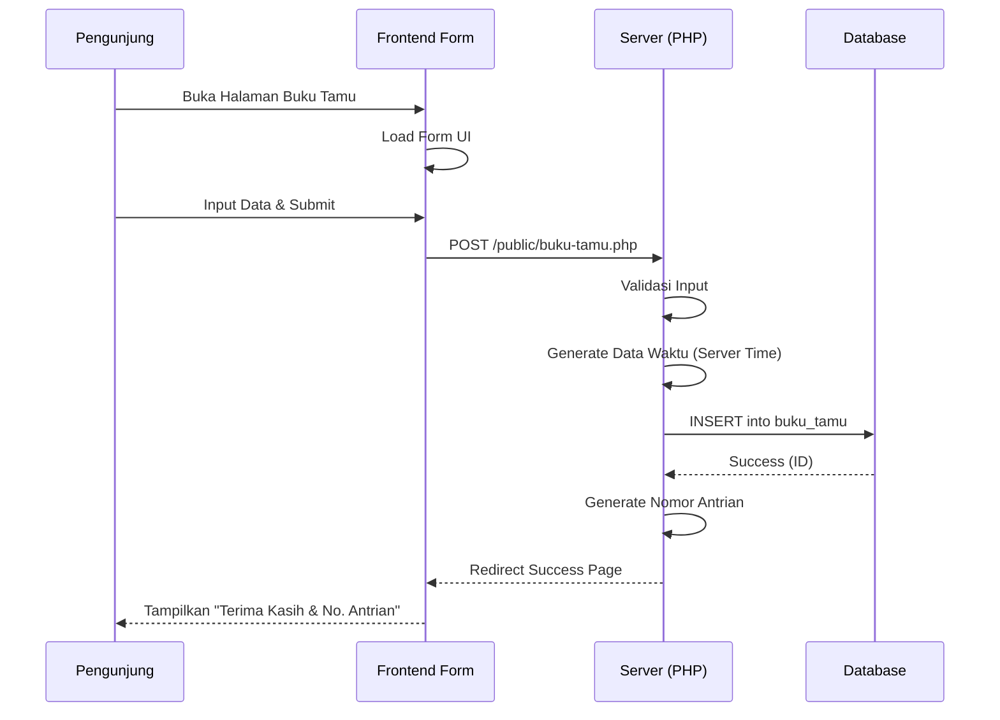

<div align="center">

# 🔥 PELITA
### **P**elayanan & **L**ihat **TA**mu

**Dokumentasi Teknis Lengkap - Versi 1.0.0**
*Sistem Informasi Buku Tamu & Kepuasan Pelanggan Digital*


Developed by **BPS Kabupaten Jember**
*"Menerangi Pelayanan, Memandu Pembangunan"*

</div>

***

## Daftar Isi

1. [Pendahuluan](#1-pendahuluan)
2. [Arsitektur Sistem](#2-arsitektur-sistem)
3. [Frontend](#3-frontend)
4. [Backend](#4-backend)
5. [Proses Bisnis](#5-proses-bisnis)
6. [Instalasi & Deployment](#6-instalasi--deployment)
7. [Pengembangan & Kontribusi](#7-pengembangan--kontribusi)
8. [Troubleshooting](#8-troubleshooting)
9. [Roadmap](#9-roadmap)

***

## 1. Pendahuluan

### 1.1 Deskripsi Aplikasi
**PELITA** (Pelayanan & Lihat Tamu) adalah sistem informasi berbasis web yang dirancang untuk mendigitalisasi proses pencatatan buku tamu dan survei kepuasan pelanggan di BPS Kabupaten Jember. Aplikasi ini menggantikan pencatatan manual, memberikan analitik real-time, dan meningkatkan profesionalisme pelayanan publik.

### 1.2 Visi dan Misi
*   **Visi**: Mewujudkan pelayanan statistik terpadu yang modern, transparan, dan berbasis data.
*   **Misi**:
    1.  Meningkatkan efisiensi pencatatan data pengunjung.
    2.  Menyediakan mekanisme umpan balik (feedback) pelanggan yang terukur.
    3.  Menyajikan data statistik pelayanan untuk pengambilan keputusan manajemen.

### 1.3 Fitur Utama
| Modul | Fitur Kunci |
| :--- | :--- |
| **Pengunjung (Public)** | • Submit Buku Tamu Digital<br>• Generate Nomor Antrian Otomatis<br>• Survei Kepuasan Pelanggan (3 Skala)<br>• Tampilan Modern Glassmorphism |
| **Admin Dashboard** | • Statistik Kunjungan (Harian/Bulanan)<br>• Manajemen Data Tamu (CRUD)<br>• Laporan Analitik Kepuasan<br>• Filter & Pencarian Canggih |
| **Reporting** | • Export Data ke Excel (.xls)<br>• Cetak Laporan PDF Resmi<br>• Rekapitulasi Otomatis |

***

## 2. Arsitektur Sistem

PELITA dibangun menggunakan arsitektur **Monolithic** dengan pola desain **MVC (Model-View-Controller)** sederhana tanpa framework berat (Pure PHP Native), untuk memastikan performa tinggi dan kemudahan deployment di berbagai lingkungan server.

### 2.1 Diagram Arsitektur

```mermaid
graph TD
    User[Pengunjung/Admin] -->|HTTP Request| WebServer[Web Server (Apache/Nginx)]
    WebServer -->|Process| App[Aplikasi PELITA (PHP 8.1)]
    
    subgraph "Application Layer"
        App --> Router[Routing (.htaccess)]
        Router --> Controller[Logic Layer (Pages)]
        Controller --> CheckAuth{Auth Check}
        CheckAuth -->|Yes| Model[Data Models (Classes)]
        CheckAuth -->|No| Login[Login Page]
    end
    
    subgraph "Data Layer"
        Model -->|PDO| DB[(MySQL 8.0 Database)]
    end
    
    subgraph "Presentation Layer"
        Controller --> View[HTML Views + Tailwind CSS]
        View -->|Response| User
    end
```

### 2.2 Teknologi Utama
*   **Backend**: PHP 8.1+ (Native OOP)
*   **Database**: MySQL 8.0 / MariaDB 10.6
*   **Frontend**: HTML5, Vanilla JavaScript
*   **Styling**: Tailwind CSS v3.4 (via CDN)
*   **Icons**: FontAwesome v6.5 (via CDN)
*   **Fonts**: Google Fonts (Poppins)

---

## 3. Frontend

Frontend PELITA dirancang dengan antarmuka modern menggunakan gaya desain **Glassmorphism** dan **Gradient Art** yang selaras dengan identitas Sensus Ekonomi 2026.

### 3.1 Struktur Direktori Frontend
```
public/
├── assets/
│   ├── images/          # Aset gambar statis
│   └── css/             # Custom CSS overrides
├── index.php            # Landing Page Utama (Modal Forms)
├── buku-tamu.php        # Halaman Form Buku Tamu Standalone
├── kepuasan.php         # Handler Form Kepuasan
└── success.php          # Halaman Konfirmasi Sukses
```

### 3.2 Dependencies
Frontend menggunakan pendekatan **CDN-first** untuk mempercepat development dan caching:
*   **Tailwind CSS**: `https://cdn.tailwindcss.com`
*   **FontAwesome**: `https://cdnjs.cloudflare.com/.../all.min.css`
*   **Google Fonts**: `https://fonts.googleapis.com` (Poppins Family)

### 3.3 Panduan UI Components
*   **Color Palette**:
    *   Primary Blue: `#003D7A` (BPS Blue)
    *   Accent Orange: `#F47920` (SE2026 Orange)
    *   Accent Coral: `#E85D4C` (SE2026 Coral)
*   **Grid System**: Menggunakan Tailwind Grid (`grid-cols-1 md:grid-cols-2`).
*   **Glass Effect**: Class utility `.glass-card` (custom CSS di header).

---

## 4. Backend

Backend dibangun dengan PHP Native murni menggunakan konsep OOP (Object Oriented Programming) untuk maintainability.

### 4.1 Struktur API & Class
Backend terorganisir dalam folder `classes/` dan `includes/`:

| Class / File | Fungsi Utama |
| :--- | :--- |
| `Database.php` | Singleton pattern koneksi PDO ke MySQL. |
| `BukuTamu.php` | Model data buku tamu: `create`, `getFiltered`, `generateNomorAntrian`. |
| `Kepuasan.php` | Model data kepuasan: `create`, `getStats`. |
| `auth.php` | Helper manajemen session login/logout admin. |
| `functions.php` | Helper global: `base_url`, `sanitize`, `format_tanggal`. |

### 4.2 Skema Database (MySQL)

**Tabel `buku_tamu`** (Data Kunjungan)
*   `id` (PK, AI)
*   `tahun`, `bulan`, `hari`, `waktu` (Waktu kunjungan otomatis)
*   `nama`, `instansi`, `nohp`, `email` (Identitas)
*   `keperluan`, `rincian`, `orang_ditemui` (Data Kunjungan)
*   `nomor_antrian` (Reset harian)

**Tabel `kepuasan`** (Feedback)
*   `id` (PK, AI)
*   `rating` (ENUM: 'Sangat Puas', 'Puas', 'Kurang Puas')
*   `email` (Identitas, nullable)
*   `komentar` (Text)
*   `waktu_stamp` (Timestamp)

**Tabel `admin`** (Autentikasi)
*   `id`, `username`, `password` (Hash bcrypt), `nama`

### 4.3 Alur Autentikasi
1.  Admin akses `/admin/login.php`.
2.  Input username & password.
3.  System memverifikasi hash dengan `password_verify()`.
4.  Jika valid → Set `$_SESSION['pelita_admin_id']`.
5.  Middleware `require_login()` melindungi halaman dashboard.

---

## 5. Proses Bisnis

### 5.1 Use Case Diagram (Teks)
*   **Aktor: Pengunjung**
    *   Mengisi Buku Tamu
    *   Mendapatkan Nomor Antrian
    *   Memberikan Feedback Kepuasan
*   **Aktor: Admin**
    *   Login System
    *   Melihat Dashboard Statistik
    *   Filter & Cari Data
    *   Export Laporan (PDF/Excel)
    *   Logout

### 5.2 Workflow: Pengisian Buku Tamu


---

## 6. Instalasi & Deployment

### 6.1 Prasyarat Sistem
*   **Web Server**: XAMPP, Laragon, Apache, atau Nginx.
*   **PHP Version**: 8.1 atau lebih baru.
*   **Database**: MySQL 5.7+ atau 8.0+.
*   **Extensions**: `pdo_mysql`, `gd`, `mbstring`, `curl`.

### 6.2 Panduan Instalasi (Development)
1.  **Clone Repository**:
    ```bash
    git clone https://github.com/bpsjember/pelita.git c:\laragon\www\pelita
    ```
2.  **Setup Database**:
    *   Buat database baru: `pelita`
    *   Import file SQL: `sql/pelita.sql`
3.  **Konfigurasi Environment**:
    *   Salin file template environment:
        ```bash
        cp .env.example .env
        ```
    *   Edit file `.env` dan sesuaikan konfigurasi database (DB_HOST, DB_USER, DB_PASS, dll).
    *   Edit `config/app.php` jika perlu mengubah BASE_URL.
4.  **Jalankan**:
    *   Buka browser: `http://localhost/pelita`

### 6.3 Panduan Deployment (Production)
1.  Upload semua file ke folder `public_html/pelita` di hosting (kecuali file `.env` lokal).
2.  Buat database di cPanel dan import `pelita.sql`.
3.  **Konfigurasi Environment (Tanpa File .env)**:
    *   Untuk keamanan, disarankan tidak mengupload file `.env` ke server production.
    *   Gunakan skrip deployment yang disediakan untuk membuat konfigurasi aman via `.htaccess`:
        ```bash
        php scripts/setup_production.php
        ```
    *   Atau set Environment Variables melalui menu cPanel "PHP Variables" atau dengan menambahkan manual ke `.htaccess`:
        ```apache
        SetEnv DB_HOST localhost
        SetEnv DB_NAME nama_database_prod
        SetEnv DB_USER user_database_prod
        SetEnv DB_PASS password_rahasia
        ```
4.  Pastikan folder `uploads` atau cache (jika ada) memiliki permission `755`.
5.  Ganti password admin default segera!

---

## 7. Pengembangan & Kontribusi

### 7.1 Setup Environment
Pastikan `display_errors = On` di `php.ini` saat development untuk debugging, namun matikan saat production.

### 7.2 Code Style Guide
*   **PHP**: Ikuti standar PSR-12 (indentasi 4 spasi, camelCase method names).
*   **HTML/CSS**: Gunakan semantic HTML tags. Class Tailwind diurutkan dari layout -> spacing -> visual.
*   **Git**: Pesan commit harus deskriptif (contoh: `feat: add export excel capability`).

### 7.3 Branching Strategy
*   `main`: Versi production stabil.
*   `develop`: Branch pengembangan utama.
*   `feature/nama-fitur`: Branch untuk fitur baru.

---

## 8. Troubleshooting

| Isu / Error | Kemungkinan Penyebab | Solusi |
| :--- | :--- | :--- |
| **"SQLSTATE[HY093]: Invalid parameter number"** | Jumlah parameter di query tidak sesuai dengan binding array. | Cek ulang method `create()` di class Model dan pastikan array key cocok. |
| **Tampilan CSS Berantakan** | Koneksi internet putus (CDN gagal load). | Pastikan server terkoneksi internet karena menggunakan Tailwind CDN. |
| **Gagal Login Admin** | Password hash tidak cocok atau session error. | Cek tabel admin, reset hash password, atau cek folder tmp session writable. |
| **Export PDF Error/Blank** | Library TCPDF/FPDF missing atau output buffer issue. | Pastikan tidak ada `echo` atau whitespace sebelum header PDF dikirim. |

---

## 9. Roadmap

Rencana pengembangan PELITA ke depan:

### Q1 2026 (Fokus: Integrasi)
*   [ ] Integrasi dengan API SSO BPS Pusat.
*   [ ] Notifikasi WhatsApp otomatis ke pengunjung (via WA Gateway).

### Q2 2026 (Fokus: Platform)
*   [ ] Pengembangan versi Mobile App (PWA).
*   [ ] Kiosk Mode untuk layar sentuh di lobi pelayanan.

### Technical Debt
*   [ ] Migrasi dari PHP Native ke Laravel 11 untuk skalabilitas jangka panjang.
*   [ ] Implementasi Unit Testing (PHPUnit).

---

## 10. Changelog

### V1.0.0 - 9 Januari 2026

**🔧 Form Buku Tamu:**
- Menyederhanakan form modal di landing page & halaman buku-tamu.php
- Membalik urutan section: **Data Kunjungan** (atas) → **Informasi Pengunjung** (bawah)
- Menghapus field yang tidak diperlukan: Jenis Kelamin, Umur, Alamat, Pendidikan, Pekerjaan
- Tanggal Kunjungan otomatis (read-only) berdasarkan server time
- Menghapus input manual Jam Datang & Jam Selesai

**📊 Export & Reporting:**
- Export Excel diubah dari CSV ke format `.xls` (HTML Table) dengan styling
- Memperbaiki layout tanda tangan pada PDF export (Buku Tamu & Kepuasan)
- Menambahkan nama & NIP Plt. Kepala BPS pada laporan PDF

**📈 Dashboard & Statistik:**
- Statistik landing page kini dinamis dari database (bukan hardcoded)
- Menampilkan "Tamu Hari Ini" dan "% Sangat Puas" secara real-time
- Memperbaiki validasi email opsional pada form Kepuasan
- Rating kepuasan menggunakan nilai ENUM yang benar

**🎨 UI/UX:**
- Footer admin panel: copyright text lebih tebal dan jelas
- Menambahkan versi aplikasi "PELITA v1.0.0" di sidebar admin

**🧹 Cleanup untuk Production:**
- Menghapus file development: node_modules, package.json, tailwind.config.js
- Menghapus file prompt dan dokumentasi lama
- Database di-truncate untuk deployment bersih

***
*Dokumen ini dibuat dan diperbarui terakhir pada: 9 Januari 2026.*

