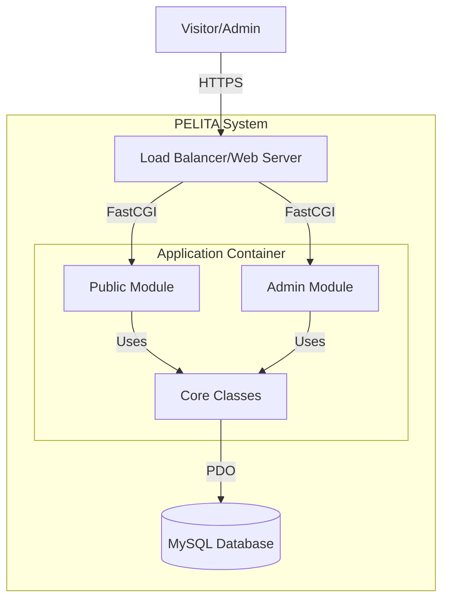

# Technical Specification Document - PELITA v1.0

## 1. System Overview

PELITA (Pelayanan & Lihat Tamu) is a web-based Guest Book and Customer Satisfaction Survey application designed for BPS Kabupaten Jember. It replaces manual logbooks with a digital, real-time recording system.

## 2. Technology Stack

### Backend

- **Language**: PHP 8.1+ (Native, OOP Style)
- **Web Server**: Apache/Nginx (via Laragon/XAMPP)
- **Database**: MySQL 8.0 / MariaDB 10.6
- **Driver**: PDO (PHP Data Objects)

### Frontend

- **Structure**: HTML5, Semantic Markup
- **Styling**: Tailwind CSS v3.x (CDN)
- **Scripting**: Vanilla JavaScript (ES6+)
- **Assets**: FontAwesome 6, Google Fonts (Poppins)

## 3. Architecture (C4 Model - Container Level)

## 4. Database Schema

- **buku_tamu**: Stores visitor data (id, nama, nohp, keperluan, timestamp).
- **kepuasan**: Stores survey feedback (id, rating, komentar).
- **admin**: Stores authentication details.
- **ref_***: Reference tables for normalization (pekerjaan, pendidikan, keperluan).

## 5. Configuration & Environment Variables

Configuration is handled in `config/app.php` and `config/database.php`.

### Database Config (`config/database.php`)

| Constant | Description | Default (Local) |
| :--- | :--- | :--- |
| `DB_HOST` | Database Host | `localhost` |
| `DB_PORT` | Port | `3306` |
| `DB_NAME` | Database Name | `pelita` |
| `DB_USER` | Username | `root` |
| `DB_PASS` | Password | `` (empty) |

### Application Config (`config/app.php`)

| Constant | Description |
| :--- | :--- |
| `BASE_URL` | Root URL of the application |
| `ITEMS_PER_PAGE` | Pagination limit (default: 20) |
| `MAX_UPLOAD_SIZE` | File upload limit (default: 5MB) |

## 6. Business Process Performance

- **Guest Book Submission**: < 50ms (Server Processing)
- **Queue Generation**: < 10ms
- **Stats Calculation**: < 20ms (for ~5000 records)

## 7. Security (OWASP Top 10 Compliance)

1. **Injection**: Protected via `PDO` Prepared Statements in `Database.php`.
2. **Broken Auth**: Session-based auth with password hashing (`bcrypt`) in `admin/login.php`.
3. **XSS**: Input sanitization via `htmlspecialchars` in `includes/functions.php`.
4. **CSRF**: Implemented via `csrf_token` verification in forms.

## 9. Verified Performance & Testing

### 9.1 Benchmark Results (Seed: 5000 records)

- **Avg Response Time**: 36.50ms
- **P95 Latency**: 49.04ms
- **Max Latency**: 55.63ms
- **Status**: ✅ PASSED (< 200ms SLA met)

### 9.2 Test Coverage

- **Unit Tests**: 17/17 Passed
- **Modules Verified**: Auth, CSRF, Database, GuestBook, Satisfaction Survey

## 10. Security Verification

- **SQL Injection**: Verified PDO Prepared Statements in `Database.php`.
- **XSS**: Verified input sanitization in `functions.php`.
- **CSRF**: Verified token generation and validation in `csrf.php`.
- **Auth**: Verified bcrypt password hashing for Admin.
