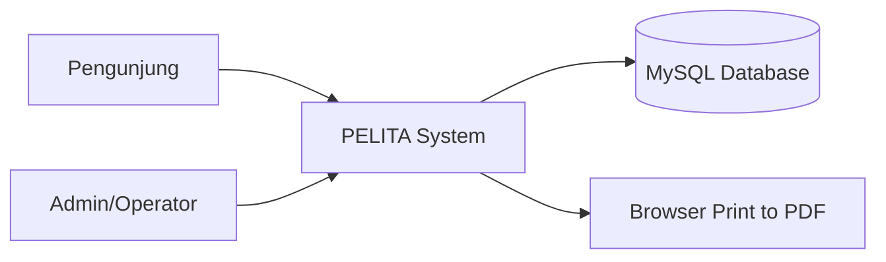
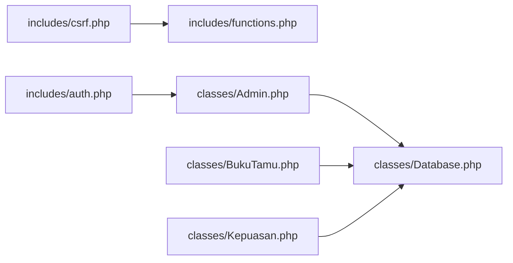

# C4 Model - PELITA

## Level 1 - System Context


## Level 2 - Container
```mermaid
flowchart TB
    subgraph Client
      B1[Public Browser]
      B2[Admin Browser]
    end

    subgraph WebServer[PHP Web App]
      C1[Public Pages\n(public/index,buku-tamu,kepuasan)]
      C2[Admin Pages\n(login,dashboard,lists,exports)]
      C3[Application Core\n(classes + includes)]
    end

    DB[(MySQL)]

    B1 --> C1
    B2 --> C2
    C1 --> C3
    C2 --> C3
    C3 --> DB
```

## Level 3 - Component (Application Core)


## Level 4 - Code Hotspots
- `classes/Database.php`: singleton connection + query abstraction.
- `classes/BukuTamu.php`: insert pipeline, queue generation, filtering/stats/export.
- `classes/Kepuasan.php`: survey insert, rating stats, trend/export.
- `includes/auth.php`: session login/logout guard.
- `includes/csrf.php`: token generation/validation.
