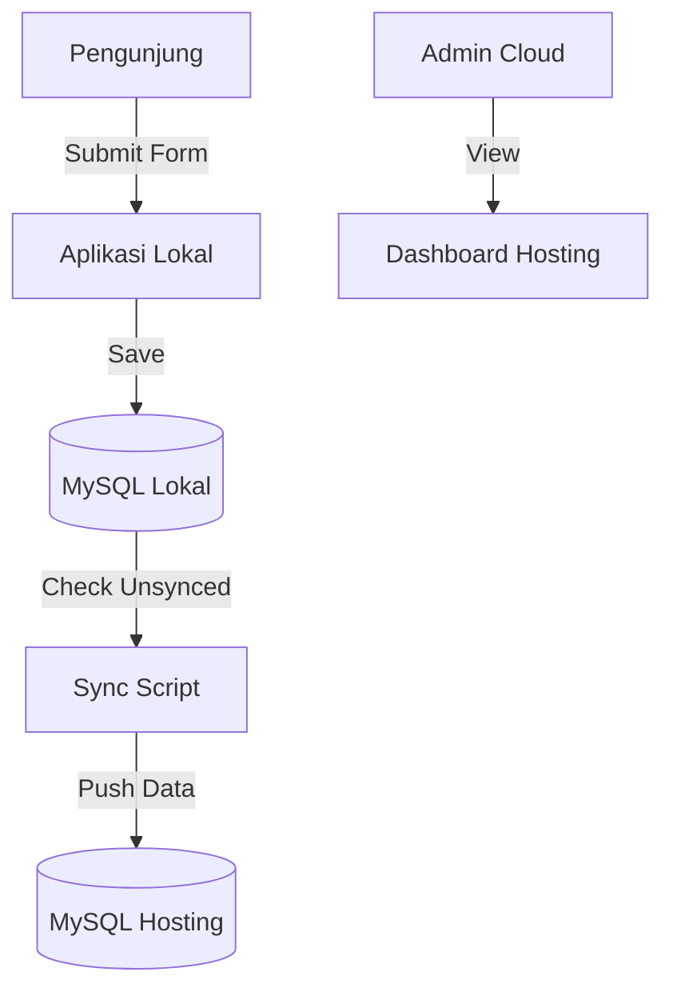

# 📄 Dokumentasi Teknis Komprehensif: PELITA

**Pelayanan & Lihat Tamu (PELITA)** - Sistem Informasi Buku Tamu Digital & Kepuasan Pelanggan BPS Kabupaten Jember.

---

## 📑 Daftar Isi
1. [Pendahuluan](#1-pendahuluan)
2. [Panduan Instalasi & Konfigurasi](#2-panduan-instalasi--konfigurasi)
3. [Arsitektur Sistem](#3-arsitektur-sistem)
4. [Dokumentasi API & Modul](#4-dokumentasi-api--modul)
5. [Panduan Fitur Utama](#5-panduan-fitur-utama)
6. [Struktur Direktori & Kode](#6-struktur-direktori--kode)
7. [Pedoman Kontribusi (Developer)](#7-pedoman-kontribusi-developer)
8. [Troubleshooting Guide](#8-troubleshooting-guide)
9. [Kontak & Pelaporan Bug](#9-kontak--pelaporan-bug)

---

## 1. Pendahuluan
PELITA adalah aplikasi berbasis web yang dirancang untuk mendigitalisasi pencatatan tamu di BPS Kabupaten Jember. Aplikasi ini menggunakan arsitektur **Hybrid Offline-Online**, memungkinkan operasional tetap berjalan meskipun koneksi internet tidak stabil.

### Fitur Kunci:
- **Offline-First**: Input data instan melalui server lokal (Laragon).
- **Auto-Sync**: Sinkronisasi otomatis data lokal ke cloud hosting.
- **Queue System**: Penomoran antrian otomatis yang direset setiap hari.
- **Analytics**: Dashboard statistik kunjungan dan kepuasan pelanggan.

---

## 2. Panduan Instalasi & Konfigurasi

### 2.1 Prasyarat Sistem
- **Web Server**: Laragon (Direkomendasikan) atau XAMPP.
- **PHP**: Version 8.1 atau lebih baru.
- **Database**: MySQL 8.0 / MariaDB 10.6.
- **Ekstensi PHP**: `pdo_mysql`, `mbstring`, `curl`, `gd`.

### 2.2 Langkah Instalasi (Lokal)
1.  **Clone Repository**:
    ```bash
    git clone https://github.com/bpsjember/pelita.git c:\laragon\www\pelita
    ```
2.  **Persiapan Database**:
    - Buat database bernama `pelita` di phpMyAdmin.
    - Import file [pelita.sql](file:///c%3A/laragon/www/pelita/sql/pelita.sql).
3.  **Konfigurasi Environment**:
    - Salin `.env.example` menjadi `.env`.
    - Sesuaikan kredensial database lokal Anda.
    ```ini
    DB_HOST=localhost
    DB_NAME=pelita
    DB_USER=root
    DB_PASS=
    ```
4.  **Akses Aplikasi**: Buka `http://localhost/pelita` di browser.

### 2.3 Konfigurasi Sinkronisasi Cloud
Untuk mengaktifkan sinkronisasi ke hosting, isi bagian `REMOTE_DB_*` di file `.env` dengan kredensial database hosting Anda.

---

## 3. Arsitektur Sistem

### 3.1 Diagram Alur Data (Hybrid Sync)


### 3.2 Komponen Utama
- **Frontend**: Tailwind CSS (UI) & Vanilla JS.
- **Controller**: [BukuTamuController.php](file:///c%3A/laragon/www/pelita/classes/BukuTamuController.php) (Logika Bisnis).
- **Model**: [BukuTamu.php](file:///c%3A/laragon/www/pelita/classes/BukuTamu.php) (Akses Data).
- **Sync Engine**: [SyncManager.php](file:///c%3A/laragon/www/pelita/classes/SyncManager.php) (Sinkronisasi Cloud).

---

## 4. Dokumentasi API & Modul

### 4.1 Modul Buku Tamu
**Endpoint**: `public/buku-tamu.php` (POST)

**Contoh Request (JSON-like):**
```json
{
  "nama": "Budi Santoso",
  "nohp": "081234567890",
  "instansi": "Universitas Jember",
  "keperluan": "Konsultasi Data",
  "email": "budi@example.com"
}
```

**Contoh Response:**
```json
{
  "success": true,
  "message": "Data berhasil disimpan",
  "nomor_antrian": "042",
  "data_id": 5001
}
```

### 4.2 Class Utama
#### `Database::getInstance()`
Menggunakan **Singleton Pattern** untuk memastikan hanya ada satu koneksi database yang aktif.
```php
$db = Database::getInstance()->getConnection();
```

---

## 5. Panduan Fitur Utama

### 5.1 Pengisian Buku Tamu
1. Klik tombol **"Isi Buku Tamu"** di halaman utama.
2. Isi formulir dengan lengkap. Validasi akan muncul otomatis jika data tidak sesuai.
3. Setelah submit, sistem akan menampilkan **Nomor Antrian**.

### 5.2 Dashboard Admin & Status Sync
Di halaman [admin/buku-tamu/index.php](file:///c%3A/laragon/www/pelita/admin/buku-tamu/index.php), terdapat kolom **Sync**:
- ☁️ **Abu-abu**: Data hanya ada di lokal.
- ✅ **Hijau**: Data sudah tersinkronisasi ke Cloud.

---

## 6. Struktur Direktori & Kode

```text
pelita/
├── admin/              # Panel Manajemen Admin
├── classes/            # Class OOP (Controller, Model, Engine)
│   ├── Database.php    # Singleton DB Connection
│   ├── SyncManager.php # Hybrid Sync Engine
│   └── ...
├── config/             # Konfigurasi App & DB
├── docs/               # Dokumentasi Teknis
├── public/             # Entry point aplikasi (CSS, JS, Assets)
├── scripts/            # Skrip otomatisasi (Migration, Sync)
├── sql/                # Skrip skema database
└── .env                # Variabel Environment (Sensitif)
```

---

## 7. Pedoman Kontribusi (Developer)

### 7.1 Standar Kode
- **PSR-12**: Gunakan standar indentasi 4 spasi dan camelCase untuk method.
- **Security**: Selalu gunakan `sanitize()` untuk input dan `validate_csrf()` untuk form.
- **Database**: Gunakan *Prepared Statements* (PDO) untuk mencegah SQL Injection.

### 7.2 Alur Pengembangan
1. Buat branch baru: `feature/nama-fitur`.
2. Lakukan perubahan kode.
3. Jalankan test suite: `php tests/test_suite.php`.
4. Submit Pull Request.

---

## 8. Troubleshooting Guide

| Masalah | Penyebab Umum | Solusi |
| :--- | :--- | :--- |
| **Gagal Koneksi DB** | `.env` salah konfigurasi. | Cek host, user, dan password di `.env`. |
| **Sync Tidak Jalan** | Firewall atau IP tidak di-whitelist. | Whitelist IP kantor di cPanel -> Remote MySQL. |
| **Error 404** | `.htaccess` tidak terbaca. | Pastikan modul `mod_rewrite` aktif di Apache. |
| **Layar Putih (WSOD)** | Error PHP tersembunyi. | Ubah `APP_DEBUG=true` di file `.env`. |

---

## 9. Kontak & Pelaporan Bug
Jika menemukan bug atau membutuhkan bantuan teknis:
- **Email**: IT Support BPS Jember (it.3509@bps.go.id)
- **Issue Tracker**: Laporkan melalui portal internal BPS Jember.
- **Versi**: v1.1.0 (Februari 2026)

---
*Dokumen ini diperbarui terakhir pada: 11 Februari 2026.*
