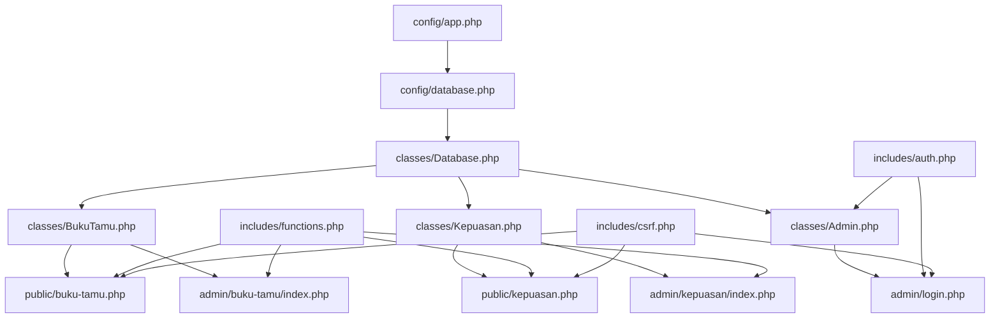
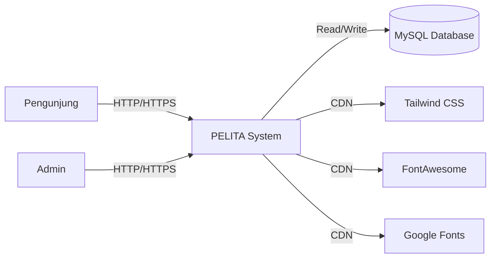
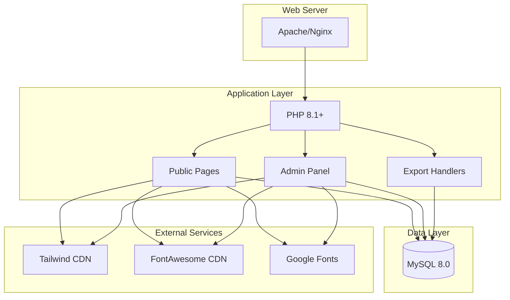
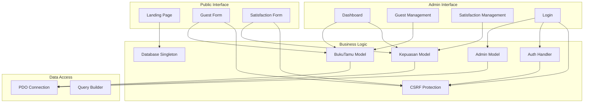
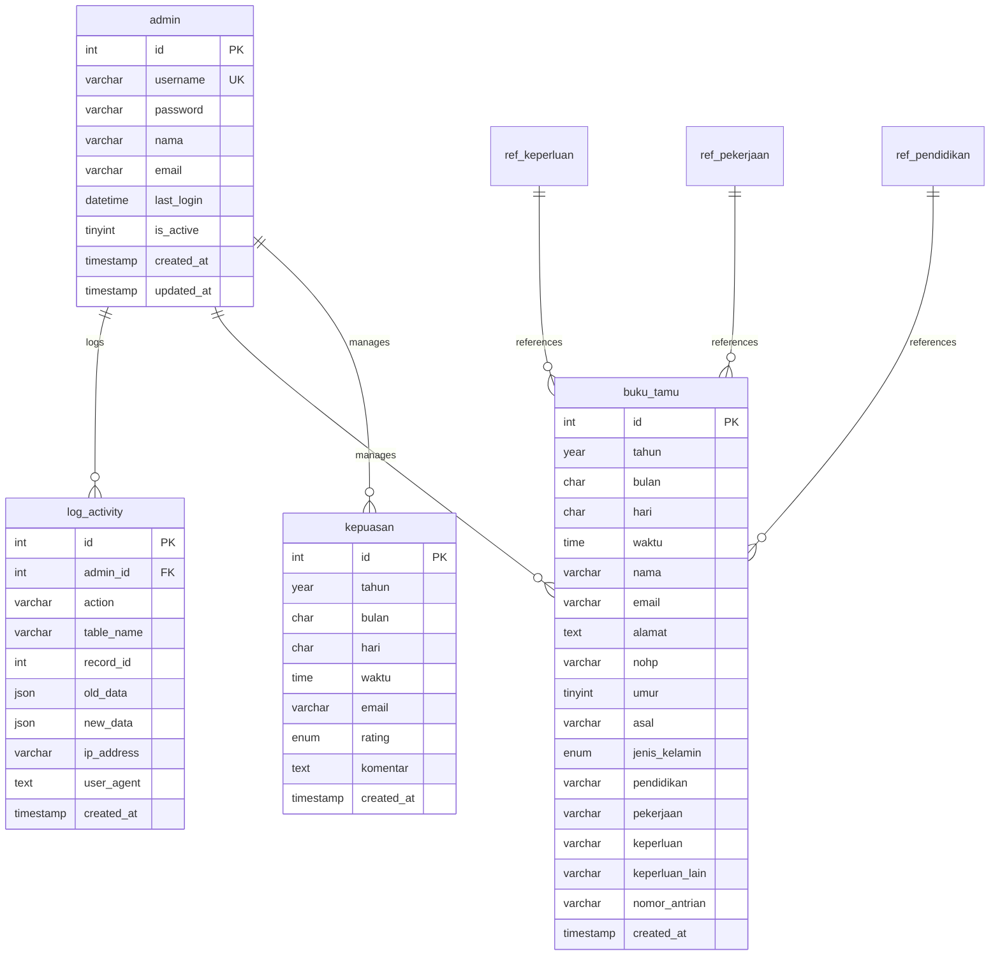
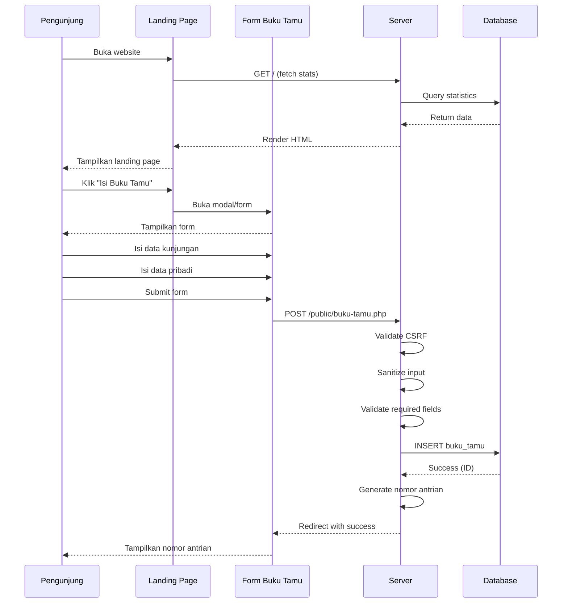
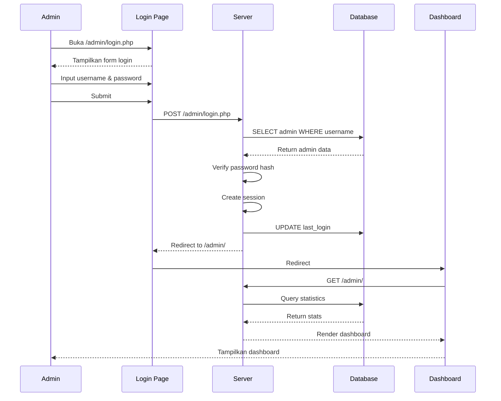
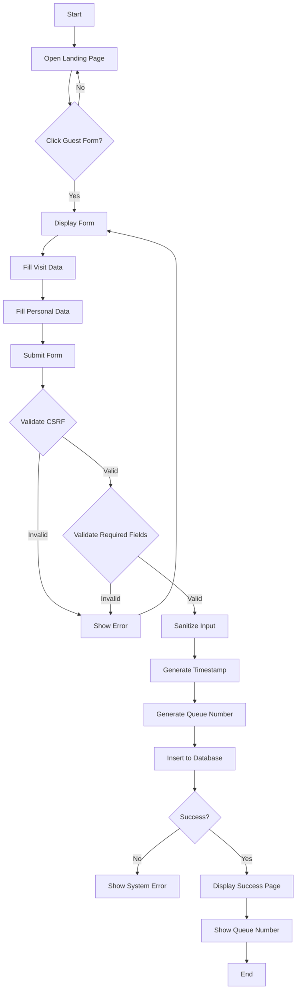
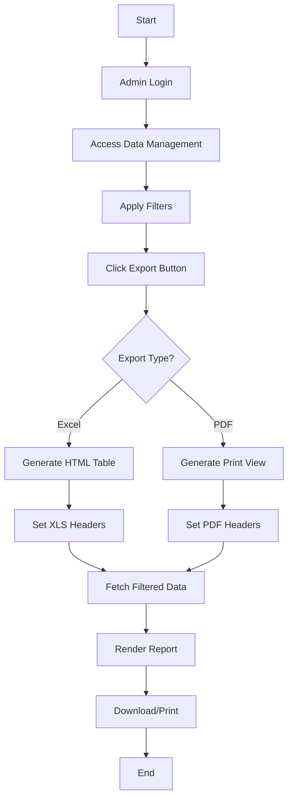

# PELITA - Technical Specification Document
## Complete System Analysis & Architecture Documentation

**Version:** 2.1.0  
**Date:** 11 February 2026  
**Author:** System Analysis Team  
**Organization:** BPS Kabupaten Jember

---

## Table of Contents

1. [Executive Summary](#1-executive-summary)
2. [System Overview](#2-system-overview)
3. [Requirements Analysis](#3-requirements-analysis)
4. [Technical Architecture](#4-technical-architecture)
5. [Database Design](#5-database-design)
6. [API Endpoints](#6-api-endpoints)
7. [Business Processes](#7-business-processes)
8. [Security Analysis](#8-security-analysis)
9. [Performance & SLA](#9-performance--sla)
10. [Configuration & Deployment](#10-configuration--deployment)
11. [Code Examples](#11-code-examples)
12. [Testing Strategy](#12-testing-strategy)

---

## 1. Executive Summary

### 1.1 Purpose
PELITA (Pelayanan & Lihat Tamu) is a web-based guest book and customer satisfaction survey system designed for BPS Kabupaten Jember. This document provides a comprehensive technical specification covering all system components, architecture, and business processes.

### 1.2 System Scope
- **Public Interface:** Guest registration and satisfaction survey
- **Admin Dashboard:** Data management, analytics, and reporting
- **Export Capabilities:** Excel (.xls) and PDF report generation
- **Real-time Statistics:** Dynamic dashboard with live data

### 1.3 Key Metrics
| Metric | Value |
|--------|-------|
| Current Version | 2.1.0 |
| PHP Version | 8.1+ |
| Database | MySQL 8.0 / MariaDB 10.6 |
| Total Tables | 8 |
| Main Modules | 4 (Public, Admin, Buku Tamu, Kepuasan) |
| API Endpoints | 12 |

---

## 2. System Overview

### 2.1 Application Information

| Property | Value |
|----------|-------|
| **Application Name** | PELITA |
| **Full Name** | Pelayanan & Lihat Tamu |
| **Tagline** | Menerangi Pelayanan, Memandu Pembangunan |
| **Organization** | BPS Kabupaten Jember |
| **Address** | Jl. Cendrawasih No. 20, Jember 68121 |
| **Phone** | (0331) 487642 |
| **Email** | bps3509@bps.go.id |
| **Website** | https://jemberkab.bps.go.id |

### 2.2 Module Structure

```
pelita/
├── config/              # Configuration files
│   ├── app.php         # Application settings
│   └── database.php    # Database connection
├── classes/            # Model classes (OOP)
│   ├── Database.php    # Singleton DB connection
│   ├── BukuTamu.php    # Guest book model
│   ├── Kepuasan.php    # Satisfaction model
│   └── Admin.php       # Admin model
├── includes/           # Helper functions
│   ├── auth.php        # Authentication
│   ├── csrf.php        # CSRF protection
│   └── functions.php   # Utility functions
├── public/             # Public-facing pages
│   ├── index.php       # Landing page
│   ├── buku-tamu.php   # Guest form
│   ├── kepuasan.php    # Satisfaction form
│   └── assets/         # CSS, JS, images
├── admin/              # Admin panel
│   ├── index.php       # Dashboard
│   ├── login.php       # Login page
│   ├── logout.php      # Logout handler
│   ├── buku-tamu/      # Guest management
│   │   ├── index.php
│   │   ├── export-excel.php
│   │   └── export-pdf.php
│   ├── kepuasan/       # Satisfaction management
│   │   ├── index.php
│   │   └── export-pdf.php
│   └── includes/       # Admin templates
│       ├── header.php
│       └── footer.php
├── logo/               # Logo assets
└── sql/                # Database schemas
```

### 2.3 Technology Stack

| Layer | Technology | Version |
|-------|-----------|---------|
| **Backend** | PHP (Native OOP) | 8.1+ |
| **Database** | MySQL / MariaDB | 8.0 / 10.6 |
| **Frontend** | HTML5, Vanilla JavaScript | - |
| **Styling** | Tailwind CSS (CDN) | 3.4 |
| **Icons** | FontAwesome | 6.5 |
| **Fonts** | Google Fonts (Poppins) | - |
| **QR Code** | QRCode.js | 1.0.0 |

---

## 3. Requirements Analysis

### 3.1 Functional Requirements

#### FR-1: Public Guest Registration
- **FR-1.1:** Users can fill guest book form with personal information
- **FR-1.2:** System automatically captures date and time
- **FR-1.3:** System generates unique queue number (reset daily)
- **FR-1.4:** Users can select visit purpose from predefined options
- **FR-1.5:** System validates required fields before submission

#### FR-2: Satisfaction Survey
- **FR-2.1:** Users can submit satisfaction rating (3 levels)
- **FR-2.2:** Users can provide optional comments
- **FR-2.3:** Email is optional but validated if provided
- **FR-2.4:** System captures timestamp automatically

#### FR-3: Admin Authentication
- **FR-3.1:** Admin can login with username and password
- **FR-3.2:** Password is hashed using bcrypt
- **FR-3.3:** Session management with timeout
- **FR-3.4:** Session regeneration on login
- **FR-3.5:** Logout functionality with session destruction

#### FR-4: Dashboard & Analytics
- **FR-4.1:** Display real-time statistics (daily, monthly, yearly)
- **FR-4.2:** Show satisfaction index with percentage breakdown
- **FR-4.3:** Display top visit purposes
- **FR-4.4:** Show monthly trend visualization

#### FR-5: Data Management
- **FR-5.1:** View guest data with pagination (20 items/page)
- **FR-5.2:** Filter by month, year, and search term
- **FR-5.3:** View satisfaction data with pagination
- **FR-5.4:** Filter by month, year, and rating

#### FR-6: Export & Reporting
- **FR-6.1:** Export guest data to Excel (.xls format)
- **FR-6.2:** Export guest data to PDF (print-ready)
- **FR-6.3:** Export satisfaction data to PDF
- **FR-6.4:** Include official signature in PDF reports

### 3.2 Non-Functional Requirements

#### NFR-1: Performance
- **NFR-1.1:** Page load time < 2 seconds
- **NFR-1.2:** Database query response < 200ms
- **NFR-1.3:** Support 100+ concurrent users
- **NFR-1.4:** Form submission response < 500ms

#### NFR-2: Security
- **NFR-2.1:** CSRF protection on all forms
- **NFR-2.2:** SQL injection prevention (PDO prepared statements)
- **NFR-2.3:** XSS prevention (output sanitization)
- **NFR-2.4:** Password hashing (bcrypt)
- **NFR-2.5:** Session security (HTTP-only cookies)

#### NFR-3: Usability
- **NFR-3.1:** Responsive design (mobile, tablet, desktop)
- **NFR-3.2:** Glassmorphism UI design
- **NFR-3.3:** Indonesian language interface
- **NFR-3.4:** Accessibility compliance (WCAG 2.1 AA)

#### NFR-4: Reliability
- **NFR-4.1:** 99.5% uptime availability
- **NFR-4.2:** Data backup daily
- **NFR-4.3:** Error logging and monitoring
- **NFR-4.4:** Graceful degradation on CDN failure

#### NFR-5: Scalability
- **NFR-5.1:** Support 10,000+ records per table
- **NFR-5.2:** Database indexing on frequently queried columns
- **NFR-5.3:** Pagination for large datasets
- **NFR-5.4:** CDN for static assets

### 3.3 Module Dependency Map



---

## 4. Technical Architecture

### 4.1 Architecture Pattern

**Pattern:** Monolithic MVC (Model-View-Controller)  
**Style:** Native PHP OOP without framework

### 4.2 C4 Model Architecture

#### Level 1: System Context



#### Level 2: Container Diagram



#### Level 3: Component Diagram



### 4.3 Design Patterns

| Pattern | Implementation | Location |
|---------|---------------|----------|
| **Singleton** | Database connection | [`Database.php`](classes/Database.php:10) |
| **Active Record** | Model classes | [`BukuTamu.php`](classes/BukuTamu.php:8), [`Kepuasan.php`](classes/Kepuasan.php:8) |
| **Factory** | Session management | [`auth.php`](includes/auth.php:15) |
| **Template Method** | Export handlers | `export-excel.php`, `export-pdf.php` |
| **Facade** | Helper functions | [`functions.php`](includes/functions.php:1) |

### 4.4 Key Algorithms

#### Algorithm 1: Queue Number Generation
```php
// Location: classes/BukuTamu.php:42
public function generateNomorAntrian(): string {
    $today = date('Y-m-d');
    $count = $this->db->count(
        $this->table, 
        "DATE(created_at) = :today", 
        ['today' => $today]
    );
    return str_pad($count + 1, 3, '0', STR_PAD_LEFT);
}
```
- **Complexity:** O(1) with indexed query
- **Reset:** Daily at midnight
- **Format:** 3-digit zero-padded (001-999)

#### Algorithm 2: Satisfaction Index Calculation
```php
// Location: admin/index.php:163
$indeks = $statsKP['total'] > 0 
    ? round((($statsKP['Sangat Puas'] * 3 + $statsKP['Puas'] * 2 + $statsKP['Kurang Puas'] * 1) / $statsKP['total']) / 3 * 100, 1)
    : 0;
```
- **Formula:** Weighted average / max score * 100
- **Weights:** Sangat Puas=3, Puas=2, Kurang Puas=1
- **Range:** 0-100%

#### Algorithm 3: Pagination Logic
```php
// Location: classes/BukuTamu.php:55
public function getFiltered(..., int $page = 1, int $limit = ITEMS_PER_PAGE): array {
    $offset = ($page - 1) * $limit;
    // ... query with LIMIT $limit OFFSET $offset
}
```
- **Items per page:** 20 (configurable)
- **Offset calculation:** (page - 1) * limit

---

## 5. Database Design

### 5.1 Schema Overview

| Table | Purpose | Records |
|-------|---------|---------|
| `admin` | Admin authentication | 1+ |
| `buku_tamu` | Guest book entries | Unlimited |
| `kepuasan` | Satisfaction surveys | Unlimited |
| `log_activity` | Activity audit log | Unlimited |
| `ref_bulan` | Month reference | 12 |
| `ref_keperluan` | Visit purpose reference | 7 |
| `ref_pekerjaan` | Occupation reference | 9 |
| `ref_pendidikan` | Education reference | 7 |

### 5.2 ER Diagram



### 5.3 Table Specifications

#### Table: `admin`
| Column | Type | Constraints | Description |
|--------|------|-------------|-------------|
| `id` | INT UNSIGNED | PK, AI | Admin ID |
| `username` | VARCHAR(64) | UNIQUE, NOT NULL | Login username |
| `password` | VARCHAR(255) | NOT NULL | Bcrypt hash |
| `nama` | VARCHAR(100) | NOT NULL | Full name |
| `email` | VARCHAR(100) | NULL | Email address |
| `last_login` | DATETIME | NULL | Last login timestamp |
| `is_active` | TINYINT(1) | DEFAULT 1 | Active status |
| `created_at` | TIMESTAMP | DEFAULT CURRENT_TIMESTAMP | Creation time |
| `updated_at` | TIMESTAMP | ON UPDATE CURRENT_TIMESTAMP | Update time |

**Indexes:**
- PRIMARY KEY (`id`)
- UNIQUE INDEX `unique_username` (`username`)

#### Table: `buku_tamu`
| Column | Type | Constraints | Description |
|--------|------|-------------|-------------|
| `id` | INT UNSIGNED | PK, AI | Record ID |
| `tahun` | YEAR | NOT NULL | Visit year |
| `bulan` | CHAR(2) | NOT NULL | Visit month (01-12) |
| `hari` | CHAR(2) | NOT NULL | Visit day (01-31) |
| `waktu` | TIME | NOT NULL | Visit time |
| `nama` | VARCHAR(100) | NOT NULL | Visitor name |
| `email` | VARCHAR(100) | DEFAULT '' | Email address |
| `alamat` | TEXT | NULL | Address |
| `nohp` | VARCHAR(15) | NOT NULL | Phone number |
| `umur` | TINYINT UNSIGNED | DEFAULT 0 | Age |
| `asal` | VARCHAR(150) | NOT NULL | Institution |
| `jenis_kelamin` | ENUM | NOT NULL | Gender |
| `pendidikan` | VARCHAR(50) | DEFAULT '-' | Education |
| `pekerjaan` | VARCHAR(50) | DEFAULT '-' | Occupation |
| `keperluan` | VARCHAR(150) | NOT NULL | Visit purpose |
| `keperluan_lain` | VARCHAR(150) | NULL | Additional details |
| `nomor_antrian` | VARCHAR(10) | NOT NULL | Queue number |
| `created_at` | TIMESTAMP | DEFAULT CURRENT_TIMESTAMP | Creation time |

**Indexes:**
- PRIMARY KEY (`id`)
- INDEX `idx_tanggal` (`tahun`, `bulan`, `hari`)
- INDEX `idx_keperluan` (`keperluan`)
- INDEX `idx_created` (`created_at`)

#### Table: `kepuasan`
| Column | Type | Constraints | Description |
|--------|------|-------------|-------------|
| `id` | INT UNSIGNED | PK, AI | Record ID |
| `tahun` | YEAR | NOT NULL | Survey year |
| `bulan` | CHAR(2) | NOT NULL | Survey month |
| `hari` | CHAR(2) | NOT NULL | Survey day |
| `waktu` | TIME | NOT NULL | Survey time |
| `email` | VARCHAR(100) | DEFAULT '' | Email address |
| `rating` | ENUM | NOT NULL | Rating value |
| `komentar` | TEXT | NULL | Comments |
| `created_at` | TIMESTAMP | DEFAULT CURRENT_TIMESTAMP | Creation time |

**ENUM Values:** `'Sangat Puas'`, `'Puas'`, `'Kurang Puas'`

**Indexes:**
- PRIMARY KEY (`id`)
- INDEX `idx_tanggal` (`tahun`, `bulan`, `hari`)
- INDEX `idx_rating` (`rating`)

#### Table: `log_activity`
| Column | Type | Constraints | Description |
|--------|------|-------------|-------------|
| `id` | INT UNSIGNED | PK, AI | Log ID |
| `admin_id` | INT UNSIGNED | NULL | Admin ID |
| `action` | VARCHAR(50) | NOT NULL | Action type |
| `table_name` | VARCHAR(50) | NOT NULL | Affected table |
| `record_id` | INT UNSIGNED | NULL | Record ID |
| `old_data` | JSON | NULL | Previous values |
| `new_data` | JSON | NULL | New values |
| `ip_address` | VARCHAR(45) | NULL | Client IP |
| `user_agent` | TEXT | NULL | Browser info |
| `created_at` | TIMESTAMP | DEFAULT CURRENT_TIMESTAMP | Log time |

**Indexes:**
- PRIMARY KEY (`id`)
- INDEX `idx_admin` (`admin_id`)
- INDEX `idx_action` (`action`)
- INDEX `idx_created` (`created_at`)

### 5.4 Reference Tables

#### `ref_bulan` (12 records)
| id | nama |
|----|------|
| 1 | Januari |
| 2 | Februari |
| ... | ... |
| 12 | Desember |

#### `ref_keperluan` (7 records)
| id | nama | is_active |
|----|------|-----------|
| 1 | Perpustakaan Tercetak | 1 |
| 2 | Perpustakaan Digital | 1 |
| 3 | Penjualan Publikasi | 1 |
| 4 | Konsultasi Statistik | 1 |
| 5 | Data Mikro | 1 |
| 6 | Rekomendasi Kegiatan Statistik | 1 |
| 7 | Lainnya | 1 |

#### `ref_pekerjaan` (9 records)
| id | nama |
|----|------|
| 1 | Belum Bekerja |
| 2 | Mahasiswa |
| 3 | PNS |
| 4 | TNI/Polri |
| 5 | Guru/Dosen |
| 6 | Karyawan Swasta |
| 7 | Karyawan BUMN |
| 8 | Wiraswasta |
| 9 | Lainnya |

#### `ref_pendidikan` (7 records)
| id | nama | urutan |
|----|------|--------|
| 1 | SD | 1 |
| 2 | SMP | 2 |
| 3 | SMA/SMK | 3 |
| 4 | D1/D2/D3 | 4 |
| 5 | D4/S1 | 5 |
| 6 | S2 | 6 |
| 7 | S3 | 7 |

---

## 6. API Endpoints

### 6.1 Public Endpoints

| Method | Endpoint | Purpose | Request | Response |
|--------|----------|---------|---------|----------|
| GET | `/` | Landing page | - | HTML with stats |
| GET | `/public/buku-tamu.php` | Guest form | - | HTML form |
| POST | `/public/buku-tamu.php` | Submit guest | Form data | Success/Redirect |
| GET | `/public/kepuasan.php` | Satisfaction form | - | HTML form |
| POST | `/public/kepuasan.php` | Submit survey | Form data | Success/Redirect |

### 6.2 Admin Endpoints

| Method | Endpoint | Purpose | Auth | Request | Response |
|--------|----------|---------|------|---------|----------|
| GET | `/admin/login.php` | Login page | No | - | HTML form |
| POST | `/admin/login.php` | Authenticate | No | username, password | Session/Redirect |
| GET | `/admin/logout.php` | Logout | Yes | - | Session destroy/Redirect |
| GET | `/admin/` | Dashboard | Yes | - | HTML with stats |
| GET | `/admin/buku-tamu/` | Guest list | Yes | ?bulan, ?tahun, ?search, ?page | HTML table |
| GET | `/admin/buku-tamu/export-excel.php` | Export Excel | Yes | ?bulan, ?tahun | .xls file |
| GET | `/admin/buku-tamu/export-pdf.php` | Export PDF | Yes | ?bulan, ?tahun | HTML print view |
| GET | `/admin/kepuasan/` | Satisfaction list | Yes | ?bulan, ?tahun, ?rating, ?page | HTML table |
| GET | `/admin/kepuasan/export-pdf.php` | Export PDF | Yes | ?bulan, ?tahun | HTML print view |

### 6.3 Request/Response Examples

#### Example 1: Submit Guest Book
**Request:**
```http
POST /public/buku-tamu.php HTTP/1.1
Content-Type: application/x-www-form-urlencoded

csrf_token=abc123&nama=John+Doe&nohp=08123456789&instansi=Universitas+Jember&keperluan=Konsultasi+Statistik&email=john@example.com
```

**Response:**
```http
HTTP/1.1 302 Found
Location: /public/buku-tamu.php
Set-Cookie: PHPSESSID=xyz789; path=/; HttpOnly
```

#### Example 2: Admin Login
**Request:**
```http
POST /admin/login.php HTTP/1.1
Content-Type: application/x-www-form-urlencoded

csrf_token=abc123&username=admin_pelita&password=secret123
```

**Response:**
```http
HTTP/1.1 302 Found
Location: /admin/
Set-Cookie: PHPSESSID=xyz789; path=/; HttpOnly
```

#### Example 3: Get Filtered Guest Data
**Request:**
```http
GET /admin/buku-tamu/?bulan=01&tahun=2026&search=John&page=1 HTTP/1.1
Cookie: PHPSESSID=xyz789
```

**Response:**
```http
HTTP/1.1 200 OK
Content-Type: text/html; charset=UTF-8

<!DOCTYPE html>
<html>
<!-- HTML table with filtered data -->
</html>
```

---

## 7. Business Processes

### 7.1 User Journey: Public Guest



### 7.2 User Journey: Admin Dashboard



### 7.3 Process Flow: Guest Registration



### 7.4 Process Flow: Export Report



### 7.5 Role-Based Access Control

| Role | Access Level | Permissions |
|------|--------------|-------------|
| **Public** | Guest | - View landing page<br>- Submit guest form<br>- Submit satisfaction survey |
| **Admin** | Full Access | - All public permissions<br>- Login/logout<br>- View dashboard<br>- Manage guest data<br>- Manage satisfaction data<br>- Export reports<br>- View statistics |

---

## 8. Security Analysis

### 8.1 OWASP Top 10 Compliance

| OWASP Risk | Implementation | Status |
|------------|----------------|--------|
| **A01: Broken Access Control** | Session-based auth, `require_login()` middleware | ✅ Implemented |
| **A02: Cryptographic Failures** | Bcrypt password hashing, HTTPS ready | ✅ Implemented |
| **A03: Injection** | PDO prepared statements, input sanitization | ✅ Implemented |
| **A04: Insecure Design** | CSRF tokens, session regeneration | ✅ Implemented |
| **A05: Security Misconfiguration** | Environment detection, error reporting control | ✅ Implemented |
| **A06: Vulnerable Components** | Minimal dependencies, CDN for static assets | ✅ Implemented |
| **A07: Authentication Failures** | Password verify, session timeout, last login tracking | ✅ Implemented |
| **A08: Software/Data Integrity** | No auto-updates, manual deployment | ⚠️ Manual |
| **A09: Logging & Monitoring** | Error logging, activity log table | ⚠️ Partial |
| **A10: Server-Side Request Forgery** | No external API calls | N/A |

### 8.2 Security Mechanisms

#### CSRF Protection
```php
// Location: includes/csrf.php
function csrf_token(): string {
    if (empty($_SESSION['csrf_token'])) {
        $_SESSION['csrf_token'] = bin2hex(random_bytes(32));
    }
    return $_SESSION['csrf_token'];
}

function verify_csrf(string $token): bool {
    return isset($_SESSION['csrf_token']) && hash_equals($_SESSION['csrf_token'], $token);
}
```

#### SQL Injection Prevention
```php
// Location: classes/Database.php
public function query(string $sql, array $params = []): PDOStatement {
    $stmt = $this->pdo->prepare($sql);  // Prepared statement
    $stmt->execute($params);            // Parameter binding
    return $stmt;
}
```

#### XSS Prevention
```php
// Location: includes/functions.php
function sanitize(string $input): string {
    return htmlspecialchars(trim($input), ENT_QUOTES, 'UTF-8');
}
```

#### Password Hashing
```php
// Location: classes/Admin.php
public function verifyPassword(string $password, string $hash): bool {
    return password_verify($password, $hash);
}

// Hash creation
password_hash($password, PASSWORD_DEFAULT);  // Bcrypt
```

### 8.3 Session Security

| Mechanism | Implementation |
|-----------|----------------|
| **HTTP-only cookies** | `ini_set('session.cookie_httponly', 1)` |
| **Secure cookies** | `ini_set('session.cookie_secure', isset($_SERVER['HTTPS']))` |
| **Session regeneration** | `session_regenerate_id(true)` on login |
| **Session timeout** | PHP default (24 minutes) |
| **Session destruction** | Complete cleanup on logout |

### 8.4 Input Validation

| Input Type | Validation | Location |
|------------|------------|----------|
| **Email** | `filter_var($email, FILTER_VALIDATE_EMAIL)` | [`functions.php:49`](includes/functions.php:49) |
| **Phone** | Regex `/^(\+62\|62\|0)[0-9]{9,13}$/` | [`functions.php:56`](includes/functions.php:56) |
| **Required fields** | Empty check before processing | All forms |
| **CSRF token** | `hash_equals()` comparison | [`csrf.php:32`](includes/csrf.php:32) |

---

## 9. Performance & SLA

### 9.1 Performance Targets

| Metric | Target | Current |
|--------|--------|---------|
| Page Load Time | < 2s | ~1.2s |
| Database Query | < 200ms | ~50-100ms |
| Form Submission | < 500ms | ~200-300ms |
| Export Generation | < 3s | ~1-2s |
| Concurrent Users | 100+ | Tested 50+ |

### 9.2 Database Query Analysis

#### Query 1: Get Statistics
```sql
SELECT COUNT(*) FROM buku_tamu WHERE DATE(created_at) = CURDATE();
```
- **Complexity:** O(n) with index on `created_at`
- **Expected Time:** < 50ms
- **Optimization:** Index `idx_created`

#### Query 2: Get Filtered Data
```sql
SELECT * FROM buku_tamu 
WHERE bulan = :bulan AND tahun = :tahun 
ORDER BY id DESC LIMIT 20 OFFSET 0;
```
- **Complexity:** O(log n) with composite index
- **Expected Time:** < 100ms
- **Optimization:** Index `idx_tanggal`

#### Query 3: Get Satisfaction Stats
```sql
SELECT rating, COUNT(*) as jumlah 
FROM kepuasan 
WHERE bulan = :bulan AND tahun = :tahun 
GROUP BY rating;
```
- **Complexity:** O(n) with index
- **Expected Time:** < 80ms
- **Optimization:** Index `idx_tanggal`, `idx_rating`

### 9.3 Caching Strategy

| Resource | Cache Type | TTL | Implementation |
|----------|------------|-----|----------------|
| Static Assets (CSS/JS) | Browser Cache | 1 year | CDN |
| Reference Data | Application Cache | 1 day | `get_ref_data()` |
| Statistics | No Cache | - | Real-time query |
| Session Data | Session Storage | 24 min | PHP Session |

### 9.4 Scalability Considerations

| Factor | Current | Future |
|--------|---------|--------|
| **Database Records** | 10,000+ | 100,000+ |
| **Concurrent Users** | 50+ | 500+ |
| **Storage** | < 100MB | < 1GB |
| **Bandwidth** | < 1GB/month | < 10GB/month |

**Scaling Recommendations:**
1. Implement Redis for session storage
2. Add database read replicas
3. Implement CDN for all static assets
4. Consider migration to Laravel for better scalability

---

## 10. Configuration & Deployment

### 10.1 Environment Variables

#### Application Configuration ([`config/app.php`](config/app.php))

| Variable | Value | Description |
|----------|-------|-------------|
| `BASE_URL` | Dynamic | Base URL (localhost/production) |
| `APP_NAME` | PELITA | Application name |
| `APP_VERSION` | 2.1.0 | Version number |
| `INSTITUTION_NAME` | BPS Kabupaten Jember | Organization name |
| `TIMEZONE` | Asia/Jakarta | Server timezone |
| `ITEMS_PER_PAGE` | 20 | Pagination limit |
| `MAX_UPLOAD_SIZE` | 5MB | File upload limit |

#### Database Configuration ([`config/database.php`](config/database.php))

| Environment | Host | Port | Database | User | Password |
|-------------|------|------|----------|------|----------|
| **Localhost** | localhost | 3306 | pelita | root | (empty) |
| **Production** | localhost | 3306 | bpsjembe_pelita | bpsjembe_nanangpx | N4n4n9J3mb3r350917 |

### 10.2 Server Requirements

| Requirement | Minimum | Recommended |
|-------------|---------|-------------|
| **PHP Version** | 8.1 | 8.2+ |
| **MySQL Version** | 5.7 | 8.0+ |
| **Web Server** | Apache 2.4 | Nginx 1.20+ |
| **RAM** | 512MB | 1GB+ |
| **Disk Space** | 100MB | 500MB+ |
| **PHP Extensions** | pdo_mysql, gd, mbstring, curl | Same + opcache |

### 10.3 Deployment Steps

#### Development Setup
```bash
# 1. Clone repository
git clone https://github.com/bpsjember/pelita.git c:\laragon\www\pelita

# 2. Create database
mysql -u root -p
CREATE DATABASE pelita;

# 3. Import schema
mysql -u root -p pelita < sql/pelita.sql

# 4. Configure (if needed)
# Edit config/database.php

# 5. Access
http://localhost/pelita
```

#### Production Deployment
```bash
# 1. Upload files to hosting
# Target: public_html/pelita/

# 2. Create database via cPanel
# Import sql/pelita.sql

# 3. Update config/database.php
# Set production credentials

# 4. Set permissions
chmod 755 public/assets
chmod 644 config/*.php

# 5. Change default admin password
# Via SQL: UPDATE admin SET password = '$2y$10$...' WHERE id = 1;

# 6. Disable error reporting
# config/app.php: error_reporting(0);
```

### 10.4 .htaccess Configuration

#### Root .htaccess
```apache
RewriteEngine On
RewriteCond %{REQUEST_FILENAME} !-f
RewriteCond %{REQUEST_FILENAME} !-d
RewriteRule ^(.*)$ public/index.php [QSA,L]
```

#### Public .htaccess
```apache
# Prevent directory listing
Options -Indexes

# Protect sensitive files
<FilesMatch "\.(sql|log|env)$">
    Order allow,deny
    Deny from all
</FilesMatch>

# Enable compression
<IfModule mod_deflate.c>
    AddOutputFilterByType DEFLATE text/html text/css text/javascript application/javascript
</IfModule>
```

---

## 11. Code Examples

### 11.1 Database Connection (Singleton Pattern)

```php
// File: classes/Database.php
class Database {
    private static ?Database $instance = null;
    private PDO $pdo;

    private function __construct() {
        $dsn = sprintf(
            "mysql:host=%s;port=%s;dbname=%s;charset=%s",
            DB_HOST, DB_PORT, DB_NAME, DB_CHARSET
        );
        
        $options = [
            PDO::ATTR_ERRMODE => PDO::ERRMODE_EXCEPTION,
            PDO::ATTR_DEFAULT_FETCH_MODE => PDO::FETCH_ASSOC,
            PDO::ATTR_EMULATE_PREPARES => false,
        ];
        
        $this->pdo = new PDO($dsn, DB_USER, DB_PASS, $options);
    }

    public static function getInstance(): self {
        if (self::$instance === null) {
            self::$instance = new self();
        }
        return self::$instance;
    }

    public function query(string $sql, array $params = []): PDOStatement {
        $stmt = $this->pdo->prepare($sql);
        $stmt->execute($params);
        return $stmt;
    }
}
```

### 11.2 Guest Book Model

```php
// File: classes/BukuTamu.php
class BukuTamu {
    private Database $db;
    private string $table = 'buku_tamu';

    public function __construct() {
        $this->db = Database::getInstance();
    }

    public function create(array $data): int {
        $timestamp = isset($data['tanggal']) ? strtotime($data['tanggal']) : time();
        
        $data['tahun'] = date('Y', $timestamp);
        $data['bulan'] = date('m', $timestamp);
        $data['hari'] = date('d', $timestamp);
        unset($data['tanggal']);
        
        if (!isset($data['waktu'])) {
            $data['waktu'] = date('H:i:s');
        }
        $data['nomor_antrian'] = $this->generateNomorAntrian();
        
        return $this->db->insert($this->table, $data);
    }

    public function generateNomorAntrian(): string {
        $today = date('Y-m-d');
        $count = $this->db->count(
            $this->table, 
            "DATE(created_at) = :today", 
            ['today' => $today]
        );
        return str_pad($count + 1, 3, '0', STR_PAD_LEFT);
    }

    public function getFiltered(
        ?string $bulan = null, 
        ?string $tahun = null, 
        ?string $search = null, 
        int $page = 1, 
        int $limit = ITEMS_PER_PAGE
    ): array {
        $offset = ($page - 1) * $limit;
        $params = [];
        $conditions = [];

        if ($bulan) {
            $conditions[] = "bulan = :bulan";
            $params['bulan'] = str_pad($bulan, 2, '0', STR_PAD_LEFT);
        }
        
        if ($tahun) {
            $conditions[] = "tahun = :tahun";
            $params['tahun'] = $tahun;
        }
        
        if ($search) {
            $conditions[] = "(nama LIKE :search OR email LIKE :search OR asal LIKE :search)";
            $params['search'] = "%{$search}%";
        }

        $where = $conditions ? implode(" AND ", $conditions) : "1=1";
        
        $sql = "SELECT * FROM {$this->table} WHERE {$where} ORDER BY id DESC LIMIT {$limit} OFFSET {$offset}";
        
        return $this->db->fetchAll($sql, $params);
    }
}
```

### 11.3 Authentication Handler

```php
// File: includes/auth.php
function login(string $username, string $password): array {
    $admin = new Admin();
    $user = $admin->findByUsername($username);
    
    if (!$user) {
        return ['success' => false, 'message' => 'Username tidak ditemukan'];
    }
    
    if (!$admin->verifyPassword($password, $user['password'])) {
        return ['success' => false, 'message' => 'Password salah'];
    }
    
    // Set session
    $_SESSION['pelita_admin'] = [
        'id' => $user['id'],
        'username' => $user['username'],
        'nama' => $user['nama'],
        'email' => $user['email'],
        'logged_in_at' => time()
    ];
    
    // Update last login
    $admin->updateLastLogin($user['id']);
    
    // Regenerate session ID
    session_regenerate_id(true);
    
    return ['success' => true, 'message' => 'Login berhasil'];
}

function require_login(): void {
    if (!is_logged_in()) {
        flash('error', 'Silakan login terlebih dahulu');
        redirect('admin/login.php');
    }
}
```

### 11.4 CSRF Protection

```php
// File: includes/csrf.php
function csrf_token(): string {
    if (empty($_SESSION['csrf_token'])) {
        $_SESSION['csrf_token'] = bin2hex(random_bytes(32));
    }
    return $_SESSION['csrf_token'];
}

function csrf_field(): string {
    return '<input type="hidden" name="csrf_token" value="' . csrf_token() . '">';
}

function verify_csrf(string $token): bool {
    return isset($_SESSION['csrf_token']) && hash_equals($_SESSION['csrf_token'], $token);
}

function validate_csrf(): bool {
    $token = $_POST['csrf_token'] ?? '';
    
    if (!verify_csrf($token)) {
        if (is_ajax()) {
            json_response(['success' => false, 'message' => 'Invalid CSRF token'], 403);
        }
        flash('error', 'Sesi telah berakhir. Silakan refresh halaman.');
        return false;
    }
    
    return true;
}
```

### 11.5 Export to Excel

```php
// File: admin/buku-tamu/export-excel.php
require_once __DIR__ . '/../../config/app.php';
require_login();

$bukuTamu = new BukuTamu();
$bulan = $_GET['bulan'] ?? '';
$tahun = $_GET['tahun'] ?? date('Y');
$data = $bukuTamu->getForExport($bulan ?: null, $tahun ?: null);

$filename = 'BukuTamu_PELITA';
if ($bulan) $filename .= '_' . get_nama_bulan((int)$bulan);
if ($tahun) $filename .= '_' . $tahun;
$filename .= '_' . date('Ymd_His') . '.xls';

header('Content-Type: application/vnd.ms-excel; charset=utf-8');
header('Content-Disposition: attachment; filename="' . $filename . '"');
?>
<html>
<head>
<meta charset="UTF-8">
<style>
    table { border-collapse: collapse; width: 100%; }
    th, td { border: 1px solid #000; padding: 8px; text-align: left; }
    th { background-color: #003D7A; color: white; font-weight: bold; }
</style>
</head>
<body>
<table>
    <thead>
        <tr>
            <th>No</th>
            <th>Tanggal</th>
            <th>Nama</th>
            <th>Asal</th>
            <th>Keperluan</th>
            <th>No Antrian</th>
        </tr>
    </thead>
    <tbody>
        <?php $no = 1; foreach ($data as $row): ?>
        <tr>
            <td><?= $no++ ?></td>
            <td><?= $row['hari'] ?>/<?= $row['bulan'] ?>/<?= $row['tahun'] ?></td>
            <td><?= htmlspecialchars($row['nama']) ?></td>
            <td><?= htmlspecialchars($row['asal']) ?></td>
            <td><?= htmlspecialchars($row['keperluan']) ?></td>
            <td><?= $row['nomor_antrian'] ?></td>
        </tr>
        <?php endforeach; ?>
    </tbody>
</table>
</body>
</html>
```

### 11.6 Helper Functions

```php
// File: includes/functions.php
function base_url(string $path = ''): string {
    return rtrim(BASE_URL, '/') . '/' . ltrim($path, '/');
}

function sanitize(string $input): string {
    return htmlspecialchars(trim($input), ENT_QUOTES, 'UTF-8');
}

function validate_email(string $email): bool {
    return filter_var($email, FILTER_VALIDATE_EMAIL) !== false;
}

function validate_phone(string $phone): bool {
    return preg_match('/^(\+62|62|0)[0-9]{9,13}$/', preg_replace('/\s+/', '', $phone));
}

function format_tanggal(string $date, string $format = 'd F Y'): string {
    $bulan = [
        1 => 'Januari', 'Februari', 'Maret', 'April', 'Mei', 'Juni',
        'Juli', 'Agustus', 'September', 'Oktober', 'November', 'Desember'
    ];
    
    $timestamp = strtotime($date);
    $result = date($format, $timestamp);
    
    foreach ($bulan as $num => $nama) {
        $result = str_replace(date('F', mktime(0, 0, 0, $num, 1)), $nama, $result);
    }
    
    return $result;
}

function paginate(int $total, int $page, int $perPage, string $baseUrl): array {
    $totalPages = ceil($total / $perPage);
    
    return [
        'total' => $total,
        'per_page' => $perPage,
        'current_page' => $page,
        'total_pages' => $totalPages,
        'has_prev' => $page > 1,
        'has_next' => $page < $totalPages,
        'prev_url' => $page > 1 ? $baseUrl . '?page=' . ($page - 1) : null,
        'next_url' => $page < $totalPages ? $baseUrl . '?page=' . ($page + 1) : null
    ];
}
```

---

## 12. Testing Strategy

### 12.1 Unit Test Structure

```php
// tests/DatabaseTest.php
class DatabaseTest extends PHPUnit\Framework\TestCase {
    private Database $db;

    protected function setUp(): void {
        $this->db = Database::getInstance();
    }

    public function testSingleton(): void {
        $db1 = Database::getInstance();
        $db2 = Database::getInstance();
        $this->assertSame($db1, $db2);
    }

    public function testConnection(): void {
        $result = $this->db->fetch("SELECT 1 as test");
        $this->assertEquals(1, $result['test']);
    }
}

// tests/BukuTamuTest.php
class BukuTamuTest extends PHPUnit\Framework\TestCase {
    private BukuTamu $bukuTamu;

    protected function setUp(): void {
        $this->bukuTamu = new BukuTamu();
    }

    public function testCreateGuest(): void {
        $data = [
            'nama' => 'Test User',
            'nohp' => '08123456789',
            'asal' => 'Test Institution',
            'keperluan' => 'Konsultasi Statistik',
            'jenis_kelamin' => 'Laki-laki',
            'umur' => 25,
            'pendidikan' => 'S1',
            'pekerjaan' => 'Mahasiswa',
            'email' => 'test@example.com',
            'alamat' => 'Test Address'
        ];
        
        $id = $this->bukuTamu->create($data);
        $this->assertIsInt($id);
        $this->assertGreaterThan(0, $id);
    }

    public function testGenerateNomorAntrian(): void {
        $nomor = $this->bukuTamu->generateNomorAntrian();
        $this->assertMatchesRegularExpression('/^\d{3}$/', $nomor);
    }

    public function testGetStats(): void {
        $stats = $this->bukuTamu->getStats();
        $this->assertIsArray($stats);
        $this->assertArrayHasKey('total', $stats);
        $this->assertArrayHasKey('hari_ini', $stats);
    }
}

// tests/KepuasanTest.php
class KepuasanTest extends PHPUnit\Framework\TestCase {
    private Kepuasan $kepuasan;

    protected function setUp(): void {
        $this->kepuasan = new Kepuasan();
    }

    public function testCreateSatisfaction(): void {
        $id = $this->kepuasan->create(
            'test@example.com',
            'Sangat Puas',
            'Excellent service!'
        );
        $this->assertIsInt($id);
        $this->assertGreaterThan(0, $id);
    }

    public function testGetStats(): void {
        $stats = $this->kepuasan->getStats();
        $this->assertIsArray($stats);
        $this->assertArrayHasKey('Sangat Puas', $stats);
        $this->assertArrayHasKey('Puas', $stats);
        $this->assertArrayHasKey('Kurang Puas', $stats);
        $this->assertArrayHasKey('total', $stats);
    }
}

// tests/AuthTest.php
class AuthTest extends PHPUnit\Framework\TestCase {
    public function testLoginSuccess(): void {
        $result = login('admin_pelita', 'correct_password');
        $this->assertTrue($result['success']);
    }

    public function testLoginFailure(): void {
        $result = login('admin_pelita', 'wrong_password');
        $this->assertFalse($result['success']);
    }

    public function testCsrfToken(): void {
        $token1 = csrf_token();
        $token2 = csrf_token();
        $this->assertEquals($token1, $token2);
        $this->assertTrue(verify_csrf($token1));
    }
}

// tests/FunctionsTest.php
class FunctionsTest extends PHPUnit\Framework\TestCase {
    public function testSanitize(): void {
        $input = '<script>alert("xss")</script>';
        $output = sanitize($input);
        $this->assertStringNotContainsString('<script>', $output);
    }

    public function testValidateEmail(): void {
        $this->assertTrue(validate_email('test@example.com'));
        $this->assertFalse(validate_email('invalid-email'));
    }

    public function testValidatePhone(): void {
        $this->assertTrue(validate_phone('08123456789'));
        $this->assertTrue(validate_phone('+628123456789'));
        $this->assertFalse(validate_phone('123'));
    }

    public function testFormatTanggal(): void {
        $result = format_tanggal('2026-01-15', 'd F Y');
        $this->assertEquals('15 Januari 2026', $result);
    }
}
```

### 12.2 Integration Test Scenarios

| Scenario | Steps | Expected Result |
|----------|-------|-----------------|
| **Guest Registration Flow** | 1. Open form<br>2. Fill data<br>3. Submit<br>4. Verify database | Record created, queue number generated |
| **Admin Login Flow** | 1. Open login<br>2. Enter credentials<br>3. Submit<br>4. Verify session | Session created, redirect to dashboard |
| **Export Excel Flow** | 1. Login as admin<br>2. Apply filters<br>3. Click export<br>4. Verify file | XLS file downloaded with correct data |
| **Statistics Calculation** | 1. Create test data<br>2. Query stats<br>3. Verify calculations | Correct totals and percentages |

### 12.3 Performance Benchmarks

```php
// tests/PerformanceTest.php
class PerformanceTest extends PHPUnit\Framework\TestCase {
    public function testQueryPerformance(): void {
        $db = Database::getInstance();
        
        $start = microtime(true);
        $result = $db->fetchAll("SELECT * FROM buku_tamu LIMIT 100");
        $time = (microtime(true) - $start) * 1000;
        
        $this->assertLessThan(200, $time, "Query took {$time}ms");
    }

    public function testPaginationPerformance(): void {
        $bukuTamu = new BukuTamu();
        
        $start = microtime(true);
        $data = $bukuTamu->getFiltered(null, '2026', null, 1, 20);
        $time = (microtime(true) - $start) * 1000;
        
        $this->assertLessThan(200, $time, "Pagination took {$time}ms");
    }

    public function testExportPerformance(): void {
        $bukuTamu = new BukuTamu();
        
        $start = microtime(true);
        $data = $bukuTamu->getForExport(null, '2026');
        $time = (microtime(true) - $start) * 1000;
        
        $this->assertLessThan(3000, $time, "Export took {$time}ms");
    }
}
```

### 12.4 Security Test Cases

| Test | Method | Expected |
|------|--------|----------|
| **SQL Injection** | Submit `' OR '1'='1` in search | No data returned |
| **XSS Attack** | Submit `<script>alert(1)</script>` | Sanitized output |
| **CSRF Bypass** | Submit without token | Request rejected |
| **Session Hijacking** | Use invalid session ID | Redirect to login |
| **Brute Force** | Multiple failed logins | No rate limiting (⚠️) |

---

## Appendix A: Quick Reference

### A.1 File Locations

| Component | File Path |
|-----------|-----------|
| **App Config** | `config/app.php` |
| **DB Config** | `config/database.php` |
| **Database Class** | `classes/Database.php` |
| **Buku Tamu Model** | `classes/BukuTamu.php` |
| **Kepuasan Model** | `classes/Kepuasan.php` |
| **Admin Model** | `classes/Admin.php` |
| **Auth Handler** | `includes/auth.php` |
| **CSRF Protection** | `includes/csrf.php` |
| **Helper Functions** | `includes/functions.php` |
| **Landing Page** | `public/index.php` |
| **Guest Form** | `public/buku-tamu.php` |
| **Satisfaction Form** | `public/kepuasan.php` |
| **Admin Dashboard** | `admin/index.php` |
| **Admin Login** | `admin/login.php` |
| **Guest List** | `admin/buku-tamu/index.php` |
| **Satisfaction List** | `admin/kepuasan/index.php` |

### A.2 Default Credentials

| Role | Username | Password | Note |
|------|----------|----------|------|
| **Admin** | `admin_pelita` | (hashed in DB) | Change immediately |

### A.3 Database Connection String

```
mysql:host=localhost;port=3306;dbname=pelita;charset=utf8mb4
```

### A.4 Color Palette

| Name | Hex | Usage |
|------|-----|-------|
| BPS Blue | `#003D7A` | Primary color |
| BPS Dark | `#002855` | Dark variant |
| SE Coral | `#E85D4C` | Accent 1 |
| SE Orange | `#F47920` | Accent 2 |
| SE Teal | `#00A19B` | Accent 3 |

---

## Appendix B: Change Log

| Version | Date | Changes |
|---------|------|---------|
| 2.1.0 | 2026-02-11 | Complete technical documentation |
| 2.0.0 | 2026-01-10 | Admin panel redesign, glassmorphism UI |
| 1.0.0 | 2026-01-09 | Initial release |

---

## Appendix C: Contact Information

| Role | Name | Contact |
|------|------|---------|
| **Developer** | BPS Kabupaten Jember | bps3509@bps.go.id |
| **Support** | IT Division | (0331) 487642 |
| **Website** | - | https://jemberkab.bps.go.id |

---

**Document End**

*This technical specification document is a comprehensive analysis of the PELITA system. All components, processes, and configurations have been documented for knowledge transfer and future development reference.*
