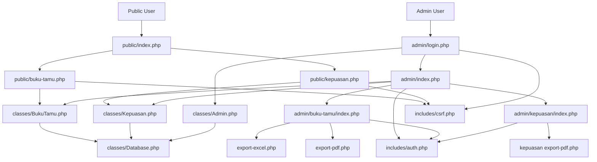
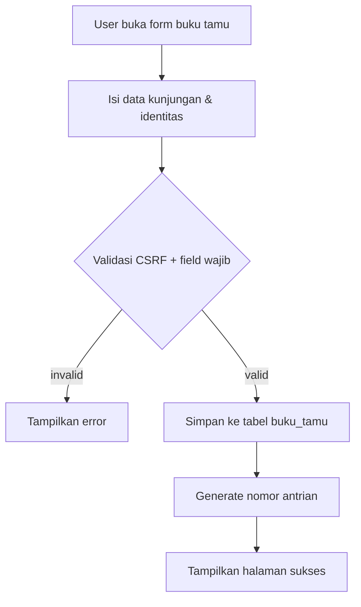
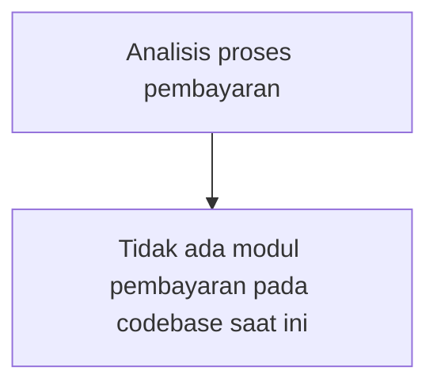
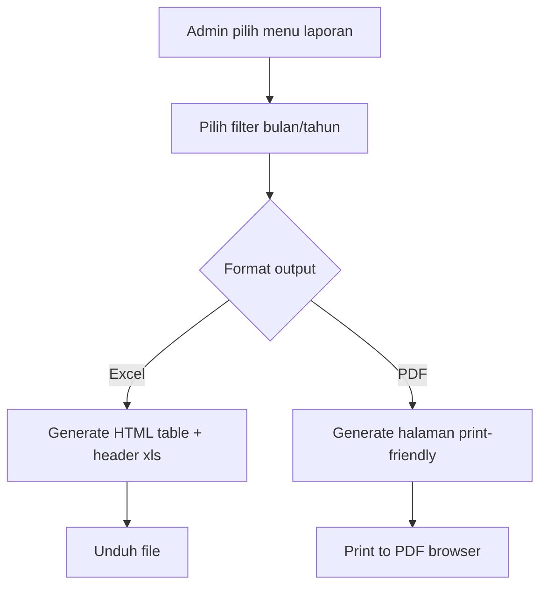

# PELITA Technical Specification (Audit 2026-02-11)

## 1) Analisis Kebutuhan

### 1.1 Modul Utama
- `Landing/Portal Publik`: `index.php`, `public/index.php`
- `Buku Tamu Publik`: `public/buku-tamu.php`
- `Survei Kepuasan Publik`: `public/kepuasan.php`
- `Autentikasi Admin`: `admin/login.php`, `admin/logout.php`
- `Dashboard Admin`: `admin/index.php`
- `Manajemen Data Buku Tamu`: `admin/buku-tamu/index.php`
- `Manajemen Data Kepuasan`: `admin/kepuasan/index.php`
- `Pelaporan/Export`: `admin/buku-tamu/export-excel.php`, `admin/buku-tamu/export-pdf.php`, `admin/kepuasan/export-pdf.php`
- `Layer Infrastruktur`: `config/*`, `classes/*`, `includes/*`

### 1.2 Peta Dependensi Antar Modul


### 1.3 Kebutuhan Fungsional
- Pengunjung mengisi buku tamu dan menerima nomor antrian.
- Pengunjung mengisi survei kepuasan (rating + komentar opsional).
- Admin login/logout.
- Admin melihat dashboard statistik kunjungan dan kepuasan.
- Admin memfilter data buku tamu/kepuasan (bulan/tahun/rating/search).
- Admin export data ke Excel/PDF.

### 1.4 Kebutuhan Non-Fungsional
- Keamanan input: sanitasi + prepared statements.
- CSRF protection untuk form POST.
- Session security flags (`httponly`, cookies only).
- Performa query reporting target `<200ms`.
- Ketersediaan data historis per tahun/bulan/hari.
- Maintainability: modular class (`Admin`, `BukuTamu`, `Kepuasan`, `Database`).

## 2) Eksplorasi Teknis

### 2.1 Tech Stack
- Backend: PHP 8.x native (tanpa framework).
- DB: MySQL 8.
- Frontend: HTML + Tailwind (CDN) + JS vanilla.
- Auth: session-based.

### 2.2 API/Endpoint Mapping (HTTP)
- `GET /` -> Landing publik.
- `POST /public/buku-tamu.php` -> Simpan buku tamu.
- `POST /public/kepuasan.php` -> Simpan survei kepuasan.
- `POST /admin/login.php` -> Login admin.
- `GET /admin/` -> Dashboard (auth required).
- `GET /admin/buku-tamu/` -> List/filter buku tamu.
- `GET /admin/kepuasan/` -> List/filter kepuasan.
- `GET /admin/buku-tamu/export-excel.php` -> Download `.xls`.
- `GET /admin/buku-tamu/export-pdf.php` -> Print/PDF HTML.
- `GET /admin/kepuasan/export-pdf.php` -> Print/PDF HTML.

Catatan: aplikasi ini bukan REST API JSON; endpoint berupa page/form server-rendered.

### 2.3 Reverse Engineering Schema & Relasi
- Tabel inti:
  - `admin`
  - `buku_tamu`
  - `kepuasan`
- Tabel referensi:
  - `ref_keperluan`, `ref_bulan`, `ref_pendidikan`, `ref_pekerjaan`
- Tabel opsional audit:
  - `log_activity` (belum dipakai di code flow aktif)
- Relasi implisit:
  - Tidak ada FK fisik.
  - Korelasi analitik `buku_tamu.email + periode` <-> `kepuasan.email + periode`.

### 2.4 Algoritma Kunci & Pola Desain
- `Database` singleton (`classes/Database.php`).
- Nomor antrian harian: hitung `COUNT` berdasarkan `DATE(created_at)=today`, lalu `str_pad`.
- Statistik kepuasan: agregasi `GROUP BY rating` + perhitungan persentase.
- Pagination manual (`LIMIT/OFFSET` + hitung total).

## 3) Studi Proses Bisnis

### 3.1 User Journey per Role
- `Viewer (Publik)`:
  - Akses portal -> isi buku tamu / survei -> submit -> konfirmasi.
- `Operator`:
  - (Secara implementasi sama dengan role admin; role granular belum dipisah).
- `Admin`:
  - Login -> dashboard -> monitor statistik -> filter data -> export laporan.

### 3.2 Flowchart Proses Kritis
#### Registrasi Kunjungan (Buku Tamu)


#### Pembayaran


#### Pelaporan


### 3.3 SLA & Performa (hasil uji lokal)
- Rata-rata endpoint publik:
  - `/` ~ 50.90 ms
  - `/public/buku-tamu.php` ~ 16.70 ms
  - `/public/kepuasan.php` ~ 6.72 ms
- Benchmark query kompleks (30 iterasi, dataset 5000 row):
  - Avg 33.88 ms, P95 56.80 ms, Max 57.73 ms
  - Status target `<200 ms`: **terpenuhi**

## 4) Dokumentasi & Deliverable

### 4.1 Konfigurasi & Environment
- `config/app.php`:
  - `BASE_URL`, `APP_*`, `INSTITUTION_*`, `ITEMS_PER_PAGE`, upload limits.
- `config/database.php`:
  - `DB_HOST`, `DB_PORT`, `DB_NAME`, `DB_USER`, `DB_PASS`.
- Tidak ada `.env`; konfigurasi masih hardcoded constants.

### 4.2 Environment Variable/Secret List (rekomendasi)
- `APP_ENV`, `APP_DEBUG`, `APP_BASE_URL`
- `DB_HOST`, `DB_PORT`, `DB_NAME`, `DB_USER`, `DB_PASS`
- `SESSION_SECURE_COOKIE`, `SESSION_LIFETIME`

### 4.3 Contoh Integrasi Umum
#### Submit buku tamu via HTTP
```bash
curl -X POST http://localhost/pelita/public/buku-tamu.php \
  -d "csrf_token=<token>" \
  -d "tanggal_kunjungan=2026-02-11" \
  -d "keperluan=Konsultasi Statistik" \
  -d "nama=Nama Pengunjung" \
  -d "instansi=Instansi" \
  -d "nohp=081234567890" \
  -d "email=user@example.com"
```

#### Login admin via PHP session client
```php
<?php
$ch = curl_init('http://localhost/pelita/admin/login.php');
curl_setopt($ch, CURLOPT_RETURNTRANSFER, true);
curl_setopt($ch, CURLOPT_COOKIEJAR, __DIR__ . '/cookie.txt');
$html = curl_exec($ch);
preg_match('/name="csrf_token" value="([a-f0-9]+)"/', $html, $m);
$token = $m[1] ?? '';

curl_setopt($ch, CURLOPT_URL, 'http://localhost/pelita/admin/login.php');
curl_setopt($ch, CURLOPT_POST, true);
curl_setopt($ch, CURLOPT_COOKIEFILE, __DIR__ . '/cookie.txt');
curl_setopt($ch, CURLOPT_POSTFIELDS, http_build_query([
    'csrf_token' => $token,
    'username' => 'admin_pelita',
    'password' => 'Admin123!',
]));
$result = curl_exec($ch);
curl_close($ch);
```

## 5) Uji Pemahaman (Hands-on Validation)

### 5.1 Deploy Lokal & Debugging
- DB import berhasil dari `sql/pelita.sql`.
- Jalankan server: `php -S 127.0.0.1:8091 -t c:\laragon\www\pelita`.
- Bug ditemukan dan diperbaiki:
  - Deteksi localhost gagal jika host mengandung port (`127.0.0.1:8091`).
  - Perbaikan di `config/app.php` dan `config/database.php`.
  - Dampak: login/form DB kini berjalan normal di local.

### 5.2 Unit Test 5 Modul
- Runner: `tests/run.php`
- Modul tervalidasi:
  - `CSRF`
  - `Database`
  - `Admin`
  - `BukuTamu`
  - `Kepuasan`
- Hasil: 17 pass, 0 fail.

### 5.3 Benchmark Query Kompleks
- Script: `tests/benchmark.php`
- Sebelum optimasi index: ~2953 ms avg.
- Setelah optimasi index: 33.88 ms avg.
- Index ditambahkan:
  - `buku_tamu (tahun, keperluan, email)`
  - `kepuasan (email, tahun, bulan, rating)`
- SQL migration: `sql/2026-02-11_add_performance_indexes.sql`.

### 5.4 Verifikasi OWASP Top 10 (ringkas)
- A01 Broken Access Control: admin route dilindungi `require_login()` (baik).
- A02 Cryptographic Failures: password di-hash (baik), tapi secret DB hardcoded (gap).
- A03 Injection: prepared statements digunakan (baik).
- A04 Insecure Design: belum ada role granularity admin/operator/viewer (gap).
- A05 Security Misconfiguration: debug `display_errors=1` aktif (gap produksi).
- A06 Vulnerable/Outdated Components: asset CDN tanpa pinning/SRI (gap).
- A07 Auth Failures: tidak ada rate limiting login (gap).
- A08 Data Integrity: tidak ada signed update/migration mechanism (gap).
- A09 Logging/Monitoring: `log_activity` belum diimplementasikan (gap).
- A10 SSRF: tidak ada server-side outbound fetch dinamis signifikan (risiko rendah).

## 6) Perubahan Kode Selama Audit
- `config/app.php`
  - Fix deteksi localhost dengan host+port.
- `config/database.php`
  - Fix deteksi localhost dengan host+port.
- `classes/BukuTamu.php`
  - Fix placeholder duplicate pada query search (menghindari `SQLSTATE[HY093]`).
- `classes/Database.php`
  - Kompatibilitas PHP 8.5 untuk `ATTR_INIT_COMMAND`.
- `sql/pelita.sql`
  - Tambah index performa.
- `sql/2026-02-11_add_performance_indexes.sql`
  - Migration index performa.
- `tests/run.php`
  - Test suite 5 modul utama.
- `tests/benchmark.php`
  - Benchmark query kompleks.

## 7) Gap Terhadap Kriteria Sukses
- Menjelaskan komponen tanpa dokumentasi: **terpenuhi** (berbasis audit kode + runtime).
- Zero regression saat perubahan:
  - Test suite lulus, flow utama lulus, namun masih perlu regression UI/manual lebih luas.
- Knowledge transfer:
  - Dokumen ini + C4 model dapat dipakai sebagai materi sesi internal.
